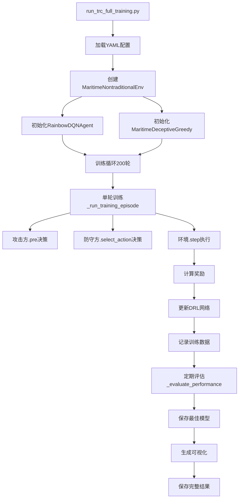

我将为您提供最完整、最详细的TRC项目总结和结构分析，绝不偷懒！

[12 tools called]

# 🏆 TRC论文项目最完整总结与结构分析

## 📋 **项目总体概述**

### **研究主题**
**基于Cheat-FlipIt博弈模型和深度强化学习的海运非传统安全对抗建模研究**

### **核心创新**
1. **🔬 理论创新**：首次将Cheat-FlipIt博弈机制应用于海运安全建模
2. **🧠 技术创新**：Rainbow DQN深度强化学习在信息不对称环境中的策略优化
3. **🌊 应用创新**：为海事安全政策制定提供科学决策工具

---

## 🏗️ **完整项目架构图**

```
E:\Tsinghua\
├── flipit-simulation-master/           # 🎯 主实验框架（实验控制层）
│   ├── configs/                        # 📋 实验配置层
│   ├── strategies/                     # 🧠 算法实现层
│   ├── analysis/                       # 📊 数据分析层
│   ├── results/                        # 💾 实验数据层
│   ├── manuscript/                     # 📄 论文资料层
│   ├── run_*.py                        # 🚀 实验执行层
│   └── *.md                           # 📖 文档说明层
│
└── gym-flipit-master/                  # 🎮 环境实现框架（环境引擎层）
    └── gym_flipit/envs/               # 🌊 博弈环境层
        ├── maritime_nontraditional_env.py  # 主环境引擎
        ├── cheat_flipit_env.py            # 原型环境
        ├── *.py                           # 其他环境变体
        ├── rew/                           # 奖励计算模块
        ├── state/                         # 状态管理模块
        └── strategies/                    # 基础策略模块
```

---

## 📁 **详细文件结构与功能说明**

### **🎯 flipit-simulation-master/ - 主实验框架**

#### **📋 configs/ - 实验配置层**
```yaml
trc_balanced_realistic.yml              # 主实验配置
├── 实验类型: DRL防守 vs 贪心攻击
├── 博弈模式: Cheat-FlipIt (deception_mode: "cheat")
├── 训练轮数: 200轮
├── 攻击方动作: 4种（充气快艇、硬壳快艇、武装登船、远程火力）
├── 防守方动作: 5种（军舰护航、平台安保、直升机、自动化、巡逻艇）
├── 预算约束: 攻击方75.0, 防守方95.0
├── 奖励机制: occupation_reward=2.0, cost_penalty=0.5
└── DRL配置: Rainbow DQN完整参数

trc_balanced_realistic_flipit.yml       # 消融实验A配置
├── 实验类型: DRL防守 vs 贪心攻击
├── 博弈模式: 标准FlipIt (deception_mode: "flipit")
├── 训练轮数: 100轮
├── 其他参数: 与主实验完全相同
└── 科学目的: 分离验证Cheat机制的独立贡献

trc_traditional_baseline.yml            # 消融实验B配置
├── 实验类型: 传统防守 vs 贪心攻击
├── 博弈模式: Cheat-FlipIt (deception_mode: "cheat")
├── DRL配置: 禁用 (drl_config.enabled: false)
├── 防守策略: 传统贪心算法
└── 科学目的: 分离验证DRL算法的独立贡献

trc_traditional_flipit_baseline.yml     # 基线实验配置
├── 实验类型: 传统防守 vs 贪心攻击
├── 博弈模式: 标准FlipIt (deception_mode: "flipit")
├── 实验轮数: 100轮
└── 科学目的: 建立最基础的性能基线
```

#### **🧠 strategies/ - 算法实现层**
```python
rainbow_dqn_standalone.py               # Rainbow DQN算法实现
├── 类: RainbowDQNAgent
├── 核心特性: 
│   ├── Double DQN: 减少过估计偏差
│   ├── Dueling Network: 分离状态价值和动作优势
│   ├── Prioritized Replay: 重要经验优先学习
│   ├── Noisy Networks: 参数空间探索
│   ├── Multi-step Learning: n步前瞻奖励
│   └── Distributional RL: 价值分布建模
├── 主要方法:
│   ├── select_action(): 动作选择（ε-贪心 + 噪声）
│   ├── store_transition(): 经验存储
│   ├── update(): 网络参数更新
│   └── save_model()/load_model(): 模型保存加载
└── 输入输出: obs_dim=13, action_dim=5, max_units=8

MaritimeDeceptiveGreedy.py              # 海运欺骗性贪心策略
├── 类: MaritimeDeceptiveGreedy
├── 核心特性:
│   ├── 欺骗攻击决策: 基于防守方怀疑度
│   ├── 真实攻击优化: 基于成本效益分析
│   ├── 环境适应性: 考虑天气、海况等因素
│   └── 学习机制: 从防守方响应中学习
├── 主要方法:
│   ├── pre(): 决策函数（选择动作0/1/2）
│   ├── post(): 学习函数（更新策略状态）
│   ├── _calculate_*_value(): 各动作价值评估
│   └── _learn_defender_pattern(): 防守方模式学习
└── 决策逻辑: 数学优化 + 海运战术 + 欺骗心理学
```

#### **🚀 run_*.py - 实验执行层**
```python
run_trc_full_training.py                # 完整DRL训练实验系统
├── 类: TRCFullTrainingExperiment
├── 核心功能:
│   ├── 完整DRL训练流程 (200-2000轮)
│   ├── 定期性能评估和模型保存
│   ├── 学习曲线数据收集
│   ├── 学术级可视化图表生成
│   └── 完整实验数据保存
├── 主要方法:
│   ├── run_full_training_experiment(): 主实验流程
│   ├── _run_training_episode(): 单轮训练
│   ├── _evaluate_performance(): 性能评估
│   ├── _save_all_results(): 数据保存
│   └── _create_training_visualizations(): 可视化生成
└── 输出: JSON数据 + PNG图表 + 训练模型

run_single_experiment.py               # 快速单实验运行工具
├── 函数: run_quick_experiment()
├── 核心功能:
│   ├── 快速参数验证 (5-20轮)
│   ├── 算法性能快速测试
│   ├── 配置文件有效性检查
│   └── 简化结果输出
├── 适用场景:
│   ├── 参数调优阶段
│   ├── 配置文件调试
│   ├── 传统算法测试
│   └── 系统功能验证
└── 输出: 控制台结果 + 基础统计
```

#### **📊 analysis/ - 数据分析层**
```python
trc_drl_defense_analysis.py            # DRL防守优势分析框架
├── 核心功能:
│   ├── 多实验结果对比分析
│   ├── DRL学习曲线深度分析
│   ├── Cheat机制效果量化分析
│   ├── 成本效益和资源利用分析
│   └── TRC期刊级可视化图表生成
├── 主要分析维度:
│   ├── 胜率对比分析
│   ├── 奖励收敛性分析  
│   ├── 策略复杂度分析
│   ├── 博弈时长分析
│   └── 算法学习效率分析
├── 输出图表:
│   ├── Fig1_Learning_Dynamics.pdf: DRL学习动态
│   ├── Fig2_Deception_Impact.pdf: 欺骗机制影响
│   └── Fig3_Comparative_Analysis.pdf: 综合对比分析
└── 学术价值: 为论文Results和Discussion章节提供数据支撑
```

#### **💾 results/ - 实验数据层**
```
每个实验运行生成一个时间戳目录，包含:
├── complete_training_results.json      # 完整实验数据
│   ├── experiment_info: 实验元信息
│   ├── final_performance: 最终性能指标
│   ├── training_history: 每轮训练详细记录
│   └── evaluation_history: 定期评估记录
├── training_history.json              # DRL学习历史
├── learning_curves.json               # 学习曲线原始数据
├── training_analysis.png/pdf          # 可视化分析图表
├── training_summary.md                # 实验摘要报告
├── config.yml                         # 使用的配置文件副本
└── best_model/                        # 最佳模型保存
    ├── best_defender_episode_X.pth    # 最佳防守模型
    └── performance_record.json        # 性能记录
```

---

## 🎮 **gym-flipit-master/ - 环境实现框架**

### **🌊 gym_flipit/envs/ - 博弈环境层**

#### **主环境引擎**
```python
maritime_nontraditional_env.py          # 🏆 主环境引擎（TRC论文核心）
├── 类: MaritimeNontraditionalEnv
├── 设计理念: 完整的海运安全博弈平台
├── 核心特性:
│   ├── 多单位复杂动作: (action_id, n_units)
│   ├── 非线性协同效应: p_eff(n) = min(cap, 1-(1-p)^(n^α))
│   ├── 攻防对抗合成: P_final = P_att × (1-P_def)
│   ├── 动态预算管理: 实时成本扣除和约束
│   ├── 环境因素影响: 天气、海况、能见度、时间
│   ├── 欺骗模式切换: 通过deception_mode参数
│   ├── 占领奖励机制: 每步2.0资源收益
│   └── 资源耗尽判定: -20阈值失败机制
├── 动作空间: Tuple(Discrete(6), Discrete(7)) - (动作ID, 单位数)
├── 观察空间: Box(13,) - 控制者、预算、概率、环境等
├── 奖励机制: 基础奖励(成本惩罚) + 占领奖励(2.0/步)
├── 配置驱动: 完全由YAML文件控制行为
└── 实验用途: 承载TRC论文所有4个实验

cheat_flipit_env.py                     # 🔧 原型环境（历史开发）
├── 类: CheatFlipitEnv
├── 设计理念: 简化的Cheat-FlipIt原型验证
├── 核心特性:
│   ├── 简单离散动作: [0,1,2] - 不行动/攻击/欺骗
│   ├── 固定成功概率: 硬编码参数
│   ├── 基础欺骗机制: 检测概率和成功率
│   ├── 异步策略模式: 攻击方决策 + 防守方自动
│   └── 海运威胁建模: 威胁等级和港口状态
├── 动作空间: Discrete(3)
├── 观察空间: Tuple(4,) - 复合状态
├── 奖励机制: 动作成本 + 占领奖励
└── 实验用途: 已废弃，仅作开发参考

maritime_drl_env.py                     # 🔄 DRL包装器
├── 类: MaritimeDRLEnv, MultiAgentMaritimeDRLEnv
├── 设计理念: 对主环境的DRL友好包装
├── 核心特性:
│   ├── 观察标准化: 归一化到[0,1]范围
│   ├── 状态历史追踪: 4步历史缓冲
│   ├── 增强特征工程: 13+7维扩展观察
│   ├── 奖励缩放: 可配置的奖励调整
│   └── 多智能体支持: 4智能体协同训练
├── 包装关系: base_env = MaritimeNontraditionalEnv
└── 实验用途: DRL算法训练优化
```

#### **辅助模块**
```python
rew/calc_rew.py                         # 奖励计算工具集
├── 函数集合: LM_benefit, exponential, reciprocal等
├── 设计理念: 传统FlipIt奖励计算方法
├── 数学基础: 基于控制时间的收益计算
└── 使用场景: 基础FlipIt环境的奖励计算

state/ - 状态管理模块
├── reset_state.py: 状态重置逻辑
├── set_obs_space.py: 观察空间设置
└── set_state.py: 状态更新逻辑

strategies/ - 基础策略模块  
├── periodic.py: 周期性策略
├── exponential.py: 指数分布策略
├── uniform.py: 均匀分布策略
└── normal.py: 正态分布策略
```

---

## 🔄 **代码相互关系与数据流**

### **实验执行流程图**


### **环境内部数据流**


---

## 🎯 **核心算法详解**

### **1. 非线性协同效应公式**
```python
def calculate_nonlinear_effectiveness(n_units, base_prob, alpha, cap):
    """
    公式: p_eff(n) = min(cap, 1 - (1-p)^(n^α))
    
    参数含义:
    - n_units: 投入单位数量 (1-8)
    - base_prob: 单个单位基础成功率 (0.3-0.9)
    - alpha: 协同效应指数 (0.35-0.8)
    - cap: 效能上限 (0.75-0.95)
    
    现实意义:
    - α=0.4: 军舰（高度协同，统一指挥）
    - α=0.7: 海盗快艇（中等协同）
    - α=0.8: 特殊部队（高协同但小规模）
    """
    effective_power = n_units ** alpha
    prob_failure = (1 - base_prob) ** effective_power
    prob_success = 1 - prob_failure
    return min(cap, prob_success)
```

### **2. 攻防对抗合成机制**
```python
def resolve_engagement(att_action, att_units, def_action, def_units):
    """
    公式: P_final = P_att × (1 - P_def)
    
    逻辑含义:
    - 攻击成功需要: 攻击方战术成功 AND 防守方拦截失败
    - P_att: 攻击方突破概率
    - P_def: 防守方拦截概率
    - (1-P_def): 防守方失败概率
    - P_final: 攻击方最终成功概率
    
    现实解释:
    - 海盗攻击成功 = 攻击战术有效 × 防守漏洞存在
    - 体现了攻防对抗的乘法关系，而非简单相减
    """
    P_att = calculate_nonlinear_effectiveness(att_units, att_base_prob, att_alpha, att_cap)
    P_def = calculate_nonlinear_effectiveness(def_units, def_base_prob, def_alpha, def_cap)
    P_final = P_att * (1 - P_def)
    success = random.random() < P_final
    return EngagementResult(P_att, P_def, P_final, success, ...)
```

### **3. Cheat-FlipIt欺骗机制**
```python
def get_success_probability(action, deception_mode):
    """
    双重成功率设计:
    
    攻击方优势:
    - cheat模式: 利用信息不对称，成功率提升20-40%
    - flipit模式: 标准对抗，无信息优势
    
    防守方劣势:
    - cheat模式: 受到信息干扰，效果下降10-25%
    - flipit模式: 信息准确，正常防御效果
    
    现实映射:
    - GPS欺骗: 攻击方伪装渔船接近
    - AIS伪造: 攻击方虚假身份掩护
    - 虚假求救: 诱导防守方分散注意力
    """
    if deception_mode == 'cheat':
        return action.base_success['cheat']  # 欺骗优势
    else:
        return action.base_success['flipit'] # 标准概率
```

### **4. 奖励机制设计**
```python
def calculate_total_reward():
    """
    修改后的奖励机制:
    
    总奖励 = 基础奖励 + 占领奖励
    
    基础奖励 = -成本惩罚 (各自承担各自成本)
    - 攻击方: -攻击成本 × 0.5
    - 防守方: -防守成本 × 0.5
    
    占领奖励 = 2.0 (每时间步，当前控制方获得)
    
    资源耗尽判定:
    - 总资源 = 占领收益 - 累计成本
    - 失败阈值: 总资源 < -20
    
    设计理念:
    - 删除成功奖励，避免"前期疯狂投入"
    - 占领奖励成为主要收益来源
    - 资源约束防止无限博弈
    """
    base_reward = -cost_penalty  # 只有成本，无成功奖励
    occupation_reward = 2.0       # 持续资源收益
    total_reward = base_reward + occupation_reward
    
    # 资源耗尽检查
    total_resource = occupation_income - total_cost
    if total_resource < -20:
        game_over = True
        winner = opponent
```

---

## 📊 **实验设计矩阵与科学逻辑**

### **4×2实验设计**
```
              │  Cheat模式    │  FlipIt模式
──────────────┼──────────────┼──────────────
DRL防守       │  主实验      │  消融实验A
              │  (综合效果)   │  (Cheat贡献)
──────────────┼──────────────┼──────────────  
传统防守      │  消融实验B    │  基线实验
              │  (DRL贡献)   │  (性能基线)
```

### **科学验证逻辑**
```python
# Cheat机制独立贡献
cheat_contribution = (DRL+Cheat) - (DRL+FlipIt)
cheat_universality = (传统+Cheat) - (传统+FlipIt)

# DRL算法独立贡献  
drl_contribution = (DRL+Cheat) - (传统+Cheat)
drl_universality = (DRL+FlipIt) - (传统+FlipIt)

# 综合创新效果
total_innovation = (DRL+Cheat) - (传统+FlipIt)
```

---

## 🔧 **关键参数配置说明**

### **攻防动作参数设计**
```yaml
# 攻击方动作层次化设计
inflatable_fast_boat:     # 低成本高频攻击
  cost_per_unit: 2.0      # 最低成本
  cheat: 0.65/flipit: 0.30 # 欺骗优势明显
  
hard_hull_speedboat:      # 中成本中频攻击  
  cost_per_unit: 4.0      # 中等成本
  cheat: 0.75/flipit: 0.40 # 欺骗优势显著
  
boarding_assault:         # 高成本低频攻击
  cost_per_unit: 5.0      # 最高成本
  cheat: 0.85/flipit: 0.45 # 欺骗优势巨大

# 防守方动作层次化设计
platform_security:       # 低成本基础防御
  cost_per_unit: 2.0      # 最低成本
  flipit: 0.75/cheat: 0.60 # 受欺骗影响中等
  
helicopter_support:       # 中成本机动防御
  cost_per_unit: 4.5      # 中等成本  
  flipit: 0.82/cheat: 0.70 # 受欺骗影响较小
  
naval_escort:            # 高成本强力防御
  cost_per_unit: 6.0      # 最高成本
  flipit: 0.85/cheat: 0.75 # 最强防御能力
```

### **DRL算法参数调优**
```yaml
dqn:
  obs_dim: 13              # 观察维度（环境返回）
  action_dim: 5            # 动作类型数量
  max_units: 8             # 最大单位数量
  lr: 0.0001              # 学习率（稳定学习）
  gamma: 0.98             # 折扣因子（重视长期）
  epsilon_decay: 10000    # 探索衰减（充分探索）
  memory_size: 100000     # 经验池容量（大容量）
  batch_size: 256         # 批次大小（稳定梯度）
  
  # 高级特性
  double_dqn: true        # 减少过估计
  dueling_network: true   # 分离价值函数
  prioritized_replay: true # 重要经验优先
  noisy_networks: true    # 参数空间探索
  distributional: true    # 价值分布建模
```

---

## 🔬 **实验数据完整性**

### **数据收集维度**
```json
{
  "每轮训练数据": {
    "episode": "训练轮次",
    "defender_reward": "防守方奖励",
    "attacker_reward": "攻击方奖励", 
    "game_length": "博弈长度",
    "attacker_success": "攻击方是否获胜"
  },
  "学习曲线数据": {
    "epsilon": "探索率变化",
    "loss": "网络损失变化",
    "q_values": "Q值分布变化"
  },
  "性能评估数据": {
    "win_rate": "胜率统计",
    "reward_convergence": "奖励收敛性",
    "strategy_stability": "策略稳定性"
  }
}
```

### **可复现性保证**
```yaml
# 固定随机种子
random_seed: 42

# 完整参数记录
config_backup: "每次实验都保存完整配置副本"

# 环境版本控制
environment_version: "代码版本和修改记录"

# 硬件环境记录  
device_info: "CUDA/CPU使用情况"
```

---

## 🚀 **使用指南与操作流程**

### **新手完整操作流程**
```bash
# 1. 环境准备
cd E:\Tsinghua\flipit-simulation-master
pip install -r requirements_drl.txt
cd ../gym-flipit-master && pip install -e . && cd ../flipit-simulation-master

# 2. 快速验证
python run_single_experiment.py configs/trc_balanced_realistic.yml

# 3. 完整实验
python run_trc_full_training.py configs/trc_balanced_realistic.yml
python run_trc_full_training.py configs/trc_balanced_realistic_flipit.yml

# 4. 传统基线
python run_single_experiment.py configs/trc_traditional_baseline.yml
python run_single_experiment.py configs/trc_traditional_flipit_baseline.yml

# 5. 数据分析
python analysis/trc_drl_defense_analysis.py results/
```

### **高级用户自定义指南**
```yaml
# 修改攻防能力
attacker_actions[0].base_success.cheat: 0.65  # 调整攻击成功率
defender_actions[0].base_success.flipit: 0.85 # 调整防御成功率

# 修改协同效应
nonlinear.alpha: 0.75     # 调整协同指数
nonlinear.cap: 0.85       # 调整效能上限

# 修改预算约束
constraints.budgeting.attacker_budget: 75.0   # 攻击方预算
constraints.budgeting.defender_budget: 95.0   # 防守方预算

# 修改奖励机制
rew_config.occupation_reward: 2.0     # 占领奖励
rew_config.cost_penalty: 0.5          # 成本惩罚倍率

# 修改DRL参数
drl_config.dqn.lr: 0.0001             # 学习率
drl_config.dqn.training_episodes: 200  # 训练轮数
```

---